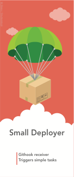

# Small Deployer 

This is a git webhook client in rust. It can be used to deploy your application automatically or anything you'd like to run after a commit.

Current compatible with Github and Gitlab hooks.

# FEATURES

- listens on /hook/ port 5000 for http requests
- matches project name against configured project in config.json
- runs the corresponding command and arguments as configured in config.json
- dumps the result of this run in console, including stderr, stdout
- can send the result of the the run on slack
- allow at most one deploy per application at the same time: if there are two commits arriving at the same time, the second one will be put on hold until the first deploy has completed. Also, if two commits arrive during a deploy, the deployer will only deploy one more time, not twice.
- support branch commits to deploy the same application with several branches

 

# BUILD INSIDE DOCKER

docker run --rm -it -v $(pwd):/source octplane/rust

apt-get update && apt-get install -y libcurl4-gnutls-dev
cargo build

# RUN

- cargo run

# TEST

Test a sample commit:

curl -X POST -d @sample.json http://127.0.0.1:5000/hook/

# TODO

- integrate with logger:
  - outputs: deploy preamble:
      - hook information (branch, commit, date, user)
      - pwd
- starts web interface
